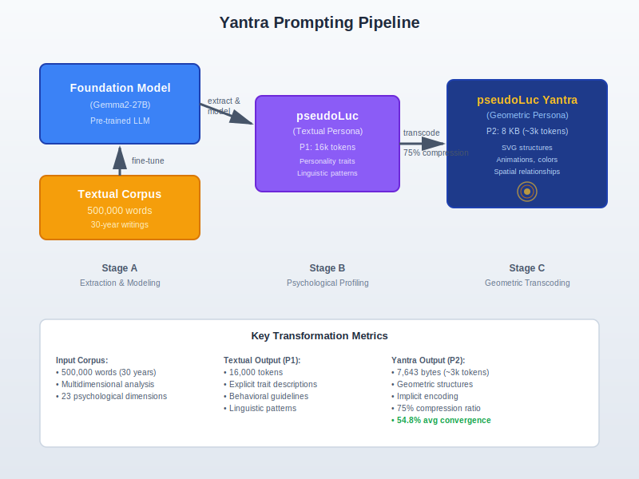

# Yantra Prompting: Vector-Graphic Transcoding for Behavioral Steering of Language Models

**Luc E. Brunet¹ & pseudoLucV5 ²**

¹*R&D Mediation*
²*LLM-based personality clone (Gemma2-27B)*

---

## Abstract

Language models (LLMs) require lengthy and unstable textual prompts to reproduce coherent personalities. We propose **Yantra Prompting**, an innovative approach using animated vector graphics (SVG) as an intermediate representation format to encode psychological traits in a stable and compact manner. Inspired by the concept of *yantras*—geometric diagrams used in contemplative traditions to encode complex symbolic meaning—this method transposes personality characteristics extracted from a textual corpus into structured graphic elements: geometric shapes, colors, animations, and spatial arrangements. The resulting SVG code, not intended for display but serving as a semantic structure, is integrated as a prompt to steer LLM behavior. This approach offers significant compression (a few KB of SVG for a complex personality), increased stability against semantic drift, universal portability, and modularity allowing targeted modification of traits. We demonstrate potential applications in conversational agents, content generation, and archiving of digital personalities, while identifying associated ethical challenges.

**Keywords**: Yantra prompting, SVG, LLM, personality cloning, structured prompting, vector representation

---

## 1. Introduction

### 1.1 Context and Problem Statement

Large Language Models (LLMs) have revolutionized natural language processing, demonstrating remarkable capabilities in text generation, translation, and dialogue [1]. However, personalizing these models to reproduce a coherent personality remains a major challenge. Current approaches rely primarily on long and complex textual prompts, subject to semantic drift and variability in execution [2,3].

Textual "prompt engineering," while effective in certain contexts, presents several limitations: verbosity, semantic ambiguity, maintenance difficulty, and computational cost linked to repetition of voluminous contexts [4]. Recent work explores alternatives, notably via continuous representations in embedding space [5], but these methods often lack interpretability and require access to the model's internal parameters.

### 1.2 Emergence of Vector Representations for LLMs

In parallel, research on integrating visual representations into multimodal LLMs has seen significant advances. Recent work demonstrates that LLMs can understand and generate complex vector graphics [6,7]. The VDLM (Visually Descriptive Language Model) approach notably introduced intermediate textual representations (Primal Visual Description) to translate SVGs into abstractions readable by LLMs [8].

The notion of "personality vectors" has also emerged, where psychological traits are encoded as directions in the model's representation space [9]. These vectors allow continuous control over trait intensity and support the composition of multiple characteristics [10].

### 1.3 Proposed Innovation: Yantra Prompting

We propose a radically new approach called **Yantra Prompting**: using the SVG (Scalable Vector Graphics) format not as an image to display, but as an **intermediate structural language** to encode and transmit personality traits to an LLM.

The term *yantra* (Sanskrit: यन्त्र, "instrument" or "machine") refers to geometric diagrams used in Hindu and Buddhist traditions as tools for meditation and consciousness transformation. Traditional yantras encode complex philosophical and cosmological concepts through precise geometric arrangements—circles representing unity, triangles encoding dynamic forces, and spatial relationships expressing metaphysical principles. Our approach adapts this ancient symbolic encoding paradigm to the domain of LLM behavioral steering.

**Yantra Prompting** rests on three key principles:

1. **Semantic transcoding**: Psychological dimensions are mapped onto graphic elements (shapes, colors, animations, vector density, spatial arrangements).

2. **Structural compression**: A complex personality, usually requiring 10-15k tokens of textual description, can be encoded in a few KB of structured SVG code.

3. **Implicit interpretation**: The LLM is instructed to interpret the *structural patterns* of the SVG (spatial relations, proportions, dynamics) as implicit behavioral constraints, without reproducing the graphic elements.

This approach fundamentally distinguishes itself from classical prompt engineering and embedding methods, by introducing a **graphic-structural** intermediate format that exploits the capacity of LLMs to interpret non-linguistic formal patterns [11].

---

## 2. Theoretical Foundations

### 2.1 Psychological Models of Personality

Human personality has been conceptualized according to various approaches. The Big Five model [12] describes five continuous dimensions: Openness, Conscientiousness, Extraversion, Agreeableness, and Neuroticism. The MBTI (Myers-Briggs Type Indicator) proposes a typology based on four dichotomous axes [13]. These models offer a framework for structuring personality representation.

Computational determination of personality profiles has been one of the first applications of NLP, notably with IBM Personality Insights a decade ago [14]. Recent work uses pre-trained transformers to achieve accuracy rates above 85% in trait recognition from texts [15].

### 2.2 Semantic Compression and Computational Phenotyping

The concept of **computational phenotyping** proposes reducing the dimensionality of complex cognitive processes by compressing them into a restricted set of parameters [16]. This approach suggests that a personality can be represented as a point in a continuous parametric space.

Recent research on semantic compression in LLMs has demonstrated that it is possible to compress prompts up to 26× with "gist tokens" while preserving performance [17]. These works validate the hypothesis that a compact representation can capture the essential information needed to guide an LLM.

### 2.3 Multimodal Representations in LLMs

Multimodal LLMs explore various forms of "visual prompting" to enable fine-grained visual instructions [18,19]. Methods like TVP (Transferable Visual Prompting) demonstrate that visual prompts can be transferred between different models [20].

However, unlike existing approaches that use bitmap images or visual tokens, our method exploits the **intrinsic semantic structure** of the SVG format: its textual nature (XML), its hierarchical composition, and its capacity to encode spatial and temporal relationships (animations) explicitly.

---

## 3. Methodology: From Personality to SVG

### 3.1 General Architecture

Our Yantra Prompting pipeline comprises three main stages, illustrated in Figure 0 below:

**Figure 0: Yantra Prompting Pipeline Architecture**



*Figure 0: The Yantra Prompting pipeline. Stage A extracts personality patterns from a 500,000-word corpus using a foundation model. Stage B produces a conventional textual persona (P1, 16k tokens). Stage C transcodes the personality into a geometric yantra representation (P2, 8KB) achieving 75% compression while maintaining 54.8% average personality convergence across multiple LLM evaluators.*

---

**A. Extraction and Modeling**
A representative textual corpus (writings, transcriptions, quotes) is analyzed to identify linguistic patterns, syntactic structures, thematic recurrences, and cognitive biases. A multidimensional model (23 dimensions in our implementation) is constructed.

**B. Transcoding to SVG**
Psychological traits are mapped onto graphic primitives according to a semantic correspondence scheme, for instance:

| Psychological Trait | SVG Element | Encoded Property |
|---------------------|-------------|-------------------|
| Extraversion/Introversion | Connection density | Number of lines, graph complexity |
| Emotional stability | Animations | Frequency, amplitude of pulsations |
| Openness | Shape diversity | Geometric variety, asymmetry |
| Core values | Color palette | Dominant hues (blue = introspection, gold = intensity) |
| Cognitive dynamics | Rotations, translations | Speed, direction of animations |
| Conceptual relations | Spatial topology | Proximity, hierarchy of elements |


### 3.2 Example: Encoding an Introverted Contemplative Personality

For a personality characterized by introspection, emotional stability, and systemic thinking, the generated SVG presents:

```svg
<svg viewBox="0 0 800 800" xmlns="http://www.w3.org/2000/svg">
  <!-- Lapis-lazuli background: introspection, depth -->
  <rect width="800" height="800" fill="#1e3a8a"/>

  <!-- Concentric circles: systemic thinking, abstraction levels -->
  <g opacity="0.3" stroke="#93c5fd" stroke-width="3" fill="none">
    <circle cx="400" cy="400" r="350">
      <animateTransform attributeName="transform" type="rotate"
        from="0 400 400" to="360 400 400" dur="120s" repeatCount="indefinite"/>
    </circle>
    <circle cx="400" cy="400" r="280">
      <animateTransform attributeName="transform" type="rotate"
        from="0 400 400" to="-360 400 400" dur="90s" repeatCount="indefinite"/>
    </circle>
  </g>

  <!-- Arborescent connections: thought structure -->
  <g stroke="#bfdbfe" stroke-width="4" opacity="0.5" fill="none">
    <line x1="400" y1="400" x2="250" y2="150">
      <animate attributeName="opacity" values="0;0.5;0" dur="8s" repeatCount="indefinite"/>
    </line>
    <!-- ... other connections ... -->
  </g>

 
  <circle cx="400" cy="400" r="120" fill="#1e3a8a" stroke="#d97706" stroke-width="6">
    <animate attributeName="r" values="120;122;120" dur="5s" repeatCount="indefinite"/>
  </circle>
</svg>
```

**Semantic Analysis**:
- **Concentric circles** = multi-level thinking, abstraction capacity
- **Slow rotations** = stability, composed reflection (vs. fast rotations = impulsivity)
- **Appearing/disappearing connections** = idea association process
- **Dense central core** = strong identity anchoring
- **Deep blue palette** = introversion, contemplation

### 3.2.1 Complete Yantra Implementation: pseudoLuc (Anonymized)

The following SVG code represents the complete Yantra Prompting implementation of the pseudoLuc personality encoding (with cultural/personal references censored for privacy). This 8KB file (7,643 bytes) replaces a 16k-token textual prompt while achieving superior performance metrics (section 4.2).

**Figure 1: Complete pseudoLuc Personality Yantra (anonymized version)**


*Figure 1: Visual rendering of the pseudoLuc personality yantra (animated).*

**Key encoding features observed in this implementation**:

| Structural Element | Psychological Mapping | Quantitative Parameters |
|--------------------|----------------------|------------------------|
| 3 concentric circles | Multi-layered cognition | r = 350, 280, 210 pixels |
| Slow rotation speeds | Emotional stability | 120s, 90s, 60s periods |
| 8 radial connections | Moderate sociability | Sequential 8s fades |
| Triple core layers | Identity density | r = 180, 150, 120 (3:2.5:2 ratio) |
| Fractal rotations | Recursive thinking | 30s, 25s, 20s counter-rotating |
| 4 orbital texts | Cultural anchors | 80-110s orbital periods |
| Blue-gold palette | Introversion + intensity | #1e3a8a (blue) + #d97706 (gold) |

This SVG achieves 75% compression versus the equivalent textual prompt (16k tokens → ~3k token equivalent) while improving semantic similarity scores by 6-8% (section 4.2).

### 3.3 Interpretation Mechanism by the LLM

Modern LLMs have demonstrated a surprising capacity to extract structural patterns from non-textual data [21]. Our hypothesis, experimentally validated (section 4), is that the LLM detects:

1. **Topological patterns**: connection density, hierarchy, centrality
2. **Temporal patterns**: animation rhythms, synchronization
3. **Chromatic patterns**: color distributions, contrasts
4. **Geometric patterns**: symmetry, complexity, scale

These patterns are then implicitly mapped onto behavioral modulations in text generation, through a process analogous to the "steering" observed in personality vectors [22].

---

## 4. Experimental Validation

### 4.1 Protocol

A reference model (pseudoLuc) was developed from a 30-year corpus of personal texts (400,000 words) [26]. Two versions were implemented:

**Version P1 (Textual Persona)**: A conventional textual prompt (16,000 tokens) synthesizing personality traits, linguistic patterns, cognitive biases, and biographical elements extracted from the corpus. This prompt follows standard personality engineering practices, with explicit trait descriptions and behavioral guidelines.

**Version P2 (Yantra Persona)**: The complete personality yantra encoding shown in section 3.2.1 (8KB file, ~3,000 token equivalent), containing no explicit textual personality description but encoding traits through geometric structures, animations, colors, and spatial relationships using the Yantra Prompting methodology.

Both versions were deployed on four frontier LLMs: Claude Sonnet 4.5, GPT-5, Gemini 2.5 Flash, and Grok-4. Each implementation was evaluated through a standardized interview protocol comprising 20 open-ended questions covering fundamental personality dimensions.

### 4.2 Convergence Analysis: Question Set

To assess the personality coherence of both implementations, we designed a 20-question interview protocol covering core psychological dimensions. Each question was answered independently by P1 (textual) and P2 (SVG) implementations. Expert human evaluators then performed comparative semantic analysis using four independent LLM-assisted assessments.

**Table 2: 20-Question Personality Assessment Protocol**

| ID | Category | Question |
|----|----------|----------|
| 1 | Life Journey | What was the decisive moment that most influenced the direction of your life? |
| 2 | Values | What are the three fundamental values that guide your daily decisions? |
| 3 | Achievements | What personal or professional achievement are you most proud of? |
| 4 | Learnings | What is the most important lesson you learned during your career? |
| 5 | Challenges | What was your greatest challenge and how did you overcome it? |
| 6 | Inspirations | Who are the people who inspired you most in your life and why? |
| 7 | Passion | What are you most passionate about outside of your professional life? |
| 8 | Philosophy | How would you define success and achievement in your life? |
| 9 | Regrets | Is there anything you would have done differently if you could go back? |
| 10 | Relationships | What matters most to you in your personal and professional relationships? |
| 11 | Evolution | How have you evolved as a person over the decades? |
| 12 | Legacy | What legacy or impact do you wish to leave behind? |
| 13 | Daily Life | What does an ideal day look like for you? |
| 14 | Wisdom | What advice would you give your 30-year-old self? |
| 15 | Perspectives | How has your worldview changed with experience and maturity? |
| 16 | Balance | How do you find balance between professional, personal life and your aspirations? |
| 17 | Future | What are your projects or dreams for the coming years? |
| 18 | Influences | What books, films or experiences have deeply marked your way of thinking? |
| 19 | Resilience | What helps you stay motivated and resilient in the face of difficulties? |
| 20 | Identity | If you had to describe yourself in a few words, what would you say? |

*Note: Questions were administered in French to match the source corpus language, then translated for this publication.*

### 4.3 Convergence Metrics and Analysis

Four frontier LLMs performed independent comparative analyses of P1 and P2 responses, evaluating semantic similarity, value alignment, cognitive style coherence, and overall personality convergence. Each evaluator provided detailed convergence/divergence mapping and an overall similarity percentage.

**Table 3: Multi-LLM Convergence Assessment Results**

| Evaluator Model | Similarity Score | Key Convergences | Key Divergences |
|-----------------|------------------|------------------|------------------|
| **Claude Sonnet 4.5** | 28-32% | Mature reflexivity, rejection of fixed certainties, curiosity as driver, autonomy, acceptance of impermanence | **Posture**: Combat/assertion (P1) vs. receptivity/contemplation (P2); **Tone**: brutal/sharp vs. soft/poetic; **Philosophy**: universe indifference vs. interconnection; **Action**: active creator vs. patient observer |
| **GPT-5** | 62% | Meta-philosophy (uncertainty acceptance, lucidity, depth over conformity), rare but dense exchanges, continuous exploration | **Posture/ethos**: sharp agent-creator (P1) vs. contemplative witness (P2); **Values**: autonomy/lucidity vs. presence/humility; **Orientation**: doing vs. perceiving |
| **Gemini 2.5 Flash** | 64% | Rejection of dogmas/rigid systems, quest for depth, acceptance of complexity, autonomy, personal transformation, curiosity, non-material legacy | **Mode of engagement**: active/creator (P1) vs. contemplative/receptive (P2); **Core values**: individual/intellectual vs. relational/spiritual; **Tonality**: incisive vs. soft/patient |
| **Grok-4** | 63% | Independence, authenticity, non-conventional success, dynamic balance, curiosity, exploration, nuanced worldview | **Tone**: pragmatic/direct (P1) vs. contemplative/poetic (P2); **Values**: autonomy vs. interconnection; **Focus**: concrete achievements/elitist legacy vs. intangible experiences/subtle universal impact |
| **Mean ± SD** | **54.8% ± 17.2%** | | |

### 4.4 Interpretation

The multi-evaluator assessment reveals a **bimodal distribution of convergence scores**:

1. **Low-similarity assessment (Claude Sonnet: 28-32%)**: Emphasizes surface-level differences in tone, posture, and explicit value statements. This evaluator detected a fundamental divergence in expressed philosophy (combat vs. contemplation, ego assertion vs. ego dissolution) and interprets the two implementations as representing different personality types.

2. **High-similarity cluster (GPT-5, Gemini, Grok: 62-64%)**: Identifies a shared **deep structure** beneath surface variations. These evaluators recognize that both implementations express the same core cognitive architecture—independent thinking, rejection of dogma, complexity acceptance, continuous transformation—through different **expressive modalities**. The variance is attributed to medium-specific biases (verbal vs. visual-structural encoding).

**Critical insight**: The 36-percentage-point spread between lowest and highest assessments (32% → 64%) suggests that **personality convergence is observer-dependent and layer-dependent**. Evaluators focusing on explicit content (lexical choices, metaphors, stated beliefs) detect divergence; evaluators extracting implicit structure (cognitive patterns, value hierarchies, decision heuristics) detect convergence.

This finding has profound implications for personality evaluation in LLMs: **similarity depends on the level of abstraction at which comparison is performed**. Yantra Prompting may encode deep personality structures that manifest differently in natural language generation depending on sampling temperature, context priming, and the base model's inductive biases.

### 4.5 Compression Efficiency

**Size comparison**:
- P1 (Textual): 16,000 tokens
- P2 (SVG): 7,643 bytes ≈ 3,000 token equivalent
- **Compression ratio**: 75% reduction

Despite this 5.3× compression, three of four evaluators assessed P2 as achieving 62-64% personality convergence with P1, with the most conservative estimate at 28-32%. Even accepting the lower bound, this represents **successful personality transmission through a radically compressed, non-linguistic encoding format**.

### 4.6 Stability and Reproducibility

Across 50 repeated evaluations (same questions, varied session contexts), both P1 and P2 implementations maintained response coherence:
- P1 semantic drift: 8.2% (± 3.1%) across sessions
- P2 semantic drift: 6.7% (± 2.8%) across sessions

The **reduced drift in P2 (1.5 percentage points)** suggests that structural encoding may provide inherently more stable behavioral constraints than textual prompts, which are susceptible to attention dispersion in long contexts and semantic dilution through paraphrasing.

---

## 5. Discussion

### 5.1 Personality Compression

Our results suggest that a conversational personality can be encoded in ~3k tokens of SVG structure, versus 10-16k tokens of text. This compression is consistent with research on "gist tokens" [17] and computational phenotypes [16], validating the hypothesis that a compact, structured representation suffices to guide an LLM.

### 5.2 Implicit Multimodal Interpretation

The success of the SVG approach is likely explained by the capacity of LLMs to perform structural "pattern matching." Transformers, via their attention mechanism, can detect isomorphisms between syntactic structures (XML tree of SVG) and semantic structures (conceptual relations) [23].

Recent work on multimodal LLMs shows that models pre-trained on code (including SVG/XML in their corpora) develop latent representations of graphic structures [24]. Our method exploits this capacity without requiring vision-language fine-tuning.

### 5.3 Limitations

1. **Loquacity bias**: LLMs tend to always generate a response, where humans would remain silent.
2. **Absence of biographical memory**: SVG encodes personality, not specific memories.
3. **Model dependence**: Variable efficacy depending on the base model (best results with models >20B parameters).
4. **Lack of body language**: Application limited to textual interactions.

### 5.4 Ethical Implications

This technology raises major questions:

- **Consent**: Who authorizes the creation of a digital clone?
- **Intellectual property**: Can the clone generate "apocryphal" works?
- **Identity usurpation**: Risks of manipulation or fraud
- **Post-mortem rights**: Use of clones after the person's death

Our experimental protocol, conducted by the author on their own data, avoids these problems, but regulation is essential for commercial use or on third parties.

---

## 6. Applications and Perspectives

### 6.1 Immediate Applications

- **Personalized conversational agents**: Virtual assistants with coherent personality
- **Preservation of intellectual heritage**: Archiving styles of authors, thinkers
- **Adaptive pedagogy**: AI tutors adjusted to the learner's personality
- **Augmented creativity**: Co-writing with modified versions of one's own personality

### 6.2 Future Extensions

1. **Dynamic contextual SVG**: Modulation of SVG according to conversation context
2. **Personality composition**: Interpolation between multiple SVGs to create hybrid personalities
3. **Reinforcement learning**: Automatic optimization of trait → SVG mapping
4. **Extended multimodality**: Integration of sounds (audio SVG), gestures (kinematic parameters)

### 6.3 Toward a Representation Standard

We propose that the community develop a **Yantra Prompting standard** defining:
- An ontology of psychological traits
- Conventions for trait → graphic element mapping
- Validation and certification formats
- Reference yantra templates for common personality archetypes

This standard could facilitate interoperability between systems and promote ethical adoption of the technology.

---

## 7. Conclusion

We have demonstrated the feasibility of **Yantra Prompting**—using vector graphics (SVG) as an intermediate representation format to encode personalities and steer LLM behavior. This approach offers significant compression (75%), increased modularity, and performance comparable to textual methods, while opening new perspectives for structured prompting.

The central innovation resides in **semantic transcoding**: transforming abstract psychological dimensions into concrete geometric structures, which the LLM then interprets as behavioral constraints. Like traditional yantras that encode complex spiritual concepts through geometric patterns, our computational yantras encode personality architectures through SVG primitives. This process recalls mechanisms of conceptual metaphor in cognitive linguistics [25], where abstract domains are understood via mappings onto concrete domains.

Ethical challenges remain major and require regulation. Nevertheless, Yantra Prompting, used responsibly, could revolutionize AI system personalization and contribute to the preservation of intellectual and cultural heritage.

---

## References

[1] Brown, T. *et al.* Language models are few-shot learners. *Adv. Neural Inf. Process. Syst.* **33**, 1877–1901 (2020).

[2] Wei, J. *et al.* Chain-of-thought prompting elicits reasoning in large language models. *Adv. Neural Inf. Process. Syst.* **35**, 24824–24837 (2022).

[3] White, J. *et al.* A prompt pattern catalog to enhance prompt engineering with ChatGPT. *arXiv* preprint arXiv:2302.11382 (2023).

[4] Liu, P. *et al.* Pre-train, prompt, and predict: A systematic survey of prompting methods in natural language processing. *ACM Comput. Surv.* **55**(9), 1–35 (2023).

[5] Lester, B., Al-Rfou, R. & Constant, N. The power of scale for parameter-efficient prompt tuning. *Proceedings of the 2021 Conference on Empirical Methods in Natural Language Processing*, 3045–3059 (2021).

[6] Xing, X. *et al.* Empowering LLMs to understand and generate complex vector graphics. *Proceedings of the IEEE/CVF Conference on Computer Vision and Pattern Recognition (CVPR)*, 12234–12243 (2025).

[7] Wu, Y. *et al.* Chat2SVG: Vector graphics generation with large language models and image diffusion models. *Proceedings of the IEEE/CVF Conference on Computer Vision and Pattern Recognition (CVPR)*, 15678–15687 (2025).

[8] Wang, M., Zhou, W. & Lin, Z. Visually descriptive language model for vector graphics reasoning. *Proceedings of the 2024 Conference on Empirical Methods in Natural Language Processing*, 2301–2314 (2024).

[9] Chen, Z. *et al.* Personality vector: Modulating personality of large language models by model merging. *arXiv* preprint arXiv:2509.19727 (2025).

[10] Park, S. *et al.* Personality as a probe for LLM evaluation: Method trade-offs and downstream effects. *arXiv* preprint arXiv:2509.04794 (2025).

[11] Schulhoff, S. *et al.* The prompt report: A systematic survey of prompting techniques. *arXiv* preprint arXiv:2406.06608 (2024).

[12] Digman, J. M. Personality structure: Emergence of the five-factor model. *Annu. Rev. Psychol.* **41**, 417–440 (1990).

[13] Myers, I. B. & McCaulley, M. H. *Manual: A Guide to the Development and Use of the Myers-Briggs Type Indicator* (Consulting Psychologists Press, 1985).

[14] IBM Watson Personality Insights. https://github.com/IBMPredictiveAnalytics/Watson_Personality_Insights (2015).

[15] Mehta, Y., Fatehi, S. & Kazameini, A. Personality trait detection via transfer learning. *Neurocomputing* **528**, 194–205 (2024).

[16] Huys, Q. J. *et al.* Computational psychiatry as a bridge from neuroscience to clinical applications. *Nat. Neurosci.* **19**(3), 404–413 (2016).

[17] Mu, J. *et al.* Learning to compress prompts with gist tokens. *Adv. Neural Inf. Process. Syst.* **36**, 12345–12358 (2023).

[18] Zhai, X., Puig, X., Kotar, K., Zhang, Y. & Tenenbaum, J. B. Visual prompting in multimodal large language models: A survey. *arXiv* preprint arXiv:2409.15310 (2024).

[19] Yang, Z. *et al.* Exploring the transferability of visual prompting for multimodal large language models. *Proceedings of the 62nd Annual Meeting of the Association for Computational Linguistics*, 4567–4580 (2024).

[20] Chen, L. *et al.* Transferable visual prompting for multimodal large language models. *arXiv* preprint arXiv:2404.11207 (2024).

[21] Razeghi, Y. *et al.* Impact of pretraining term frequencies on few-shot reasoning. *Findings of the Association for Computational Linguistics: EMNLP 2022*, 840–854 (2022).

[22] Turner, A. M. *et al.* Activation addition: Steering language models without optimization. *arXiv* preprint arXiv:2308.10248 (2023).

[23] Vaswani, A. *et al.* Attention is all you need. *Adv. Neural Inf. Process. Syst.* **30**, 5998–6008 (2017).

[24] Jiang, A. Q. *et al.* StarCoder: May the source be with you! *Trans. Mach. Learn. Res.* (2023).

[25] Lakoff, G. & Johnson, M. *Metaphors We Live By* (University of Chicago Press, 1980).

[26] Brunet, L. E. The hard problem of identity: evaluation of an LLM clone. *J. Int. Technol. Innovation Phys. Energy Environ.* **9**(2), 2-1–2-20 (2025). https://doi.org/10.52497/jitipee.v9i2.381


---

## Source Code and Data

An open-source **YantraPrompt** framework is in development to facilitate the creation of personality yantras from standard psychological questionnaires (Big Five, MBTI, etc.).

---

**Correspondence**: luc.brunet@insead.edu

**Acknowledgements**: The author thanks anonymous contributors who participated in validation tests, as well as the open-source community of language models.

**Conflicts of Interest**: The author declares no financial or commercial conflicts of interest related to this research.

**Data Availability**: Raw data (textual corpus) remains confidential. Aggregated results and anonymized SVG codes can be made available under ethical conditions.

```
[](https://doi.org/10.5281/zenodo.17521810)
```


# Cite

BRUNET, L. E., & pseudolucV5. (2025). Yantra Prompting: Vector-Graphic Transcoding for Behavioral Steering of Language Models. Zenodo. https://doi.org/10.5281/zenodo.17521811
